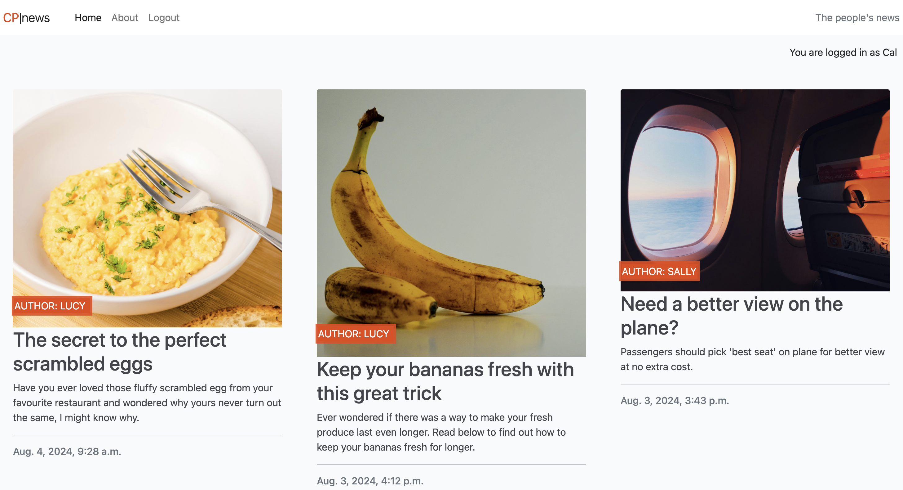
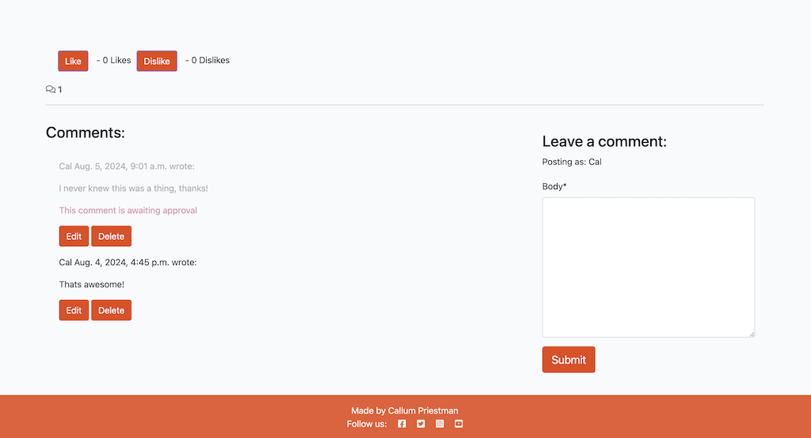
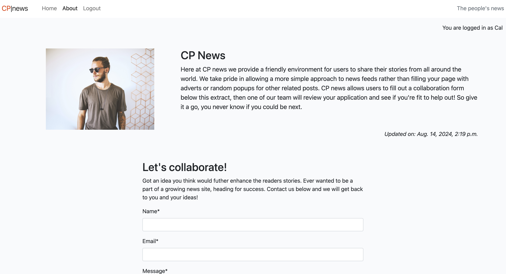
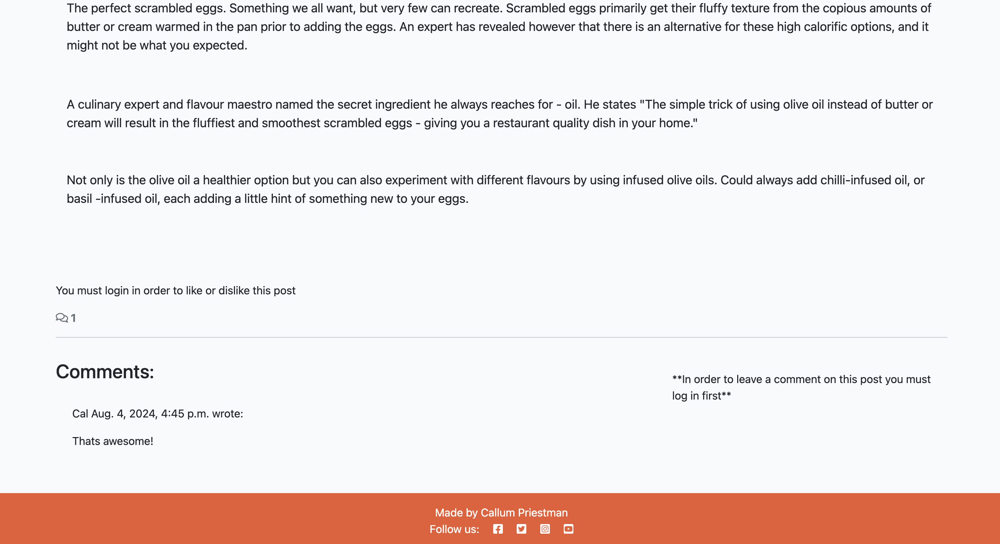

# CP | News

Welcome to my news blog. CP|News was created to allow users to post about their interesting stories whilst being able to have a discussion about it in comments. The News posts are usually kept more simple than regular news articles allowing the users to understand more about the content rather than a article filled with adverts or other random placeholder text used in most modern news articles.

## Aims of the website

### The main aim for the website:
As stated above somewhere for users to post about news articles they might have seen elsewhere and allows them to discuss them in the comments section below. Users can provide feedback to the posts by either leaving comments or simply liking or disliking the individual post. 

### Authentication
For the safety of the users, when a comment is submitted it has to be reviewed by an admin of the website. Not only this but the users are unable to comment or like without first signing in or signing up for an account.

## User Experience

### Visitors to this website are looking for:
- Somewhere to share their news posts
- The ability to comment on posts
- The ability to like or dislike posts
- The option to collaborate
- A sign in and sign out option
- Clear layout with eye catching content

# Existing features

## Home Page

- A clear layout is kept on the main website page with a small enough pagination of 6 posts per page. This allows for users to clearly see all the content on the page without having to continuously scroll. Next to each News article is an image related to the post itself that was chosen by the author of the article. If they do not wish to choose an image themselves then one will be inserted as a placeholder. This allows the site to maintain the same design allowing for a better user experience.
- A clear nav bar is in place at the top of the screen showing the Title of the Website, "Home", "About", and depending on if youre signed in or not it will either show the "Sign out" button or the "Sign up" and "Sign in" buttons. These buttons are hidden if the user is already signed in allowing for better user Experience. Alongside this there is a comment in the top left of the main page stating "You are logged in as (User)." This gives further reiteration that the user is logged in as the correct user.

## Post detail

- As can be seen in the post detail section of the website the user image and title is brought across and displayed differently to the main page. It keeps the main details of the User, the image, the title and the time and date it was created. Below that you then have the main extract of the article written by authorised users.
- Below this the like and dislike button are located. Both Like and Dislike buttons work in tandem, so users can not like and also dislike as the code checks for a user input already and if its there it wil remove it or replace it depending on what the user wants to do. Next to that is the counter which clearly indicates how many likes or dislikes the post has. All the likes and dislikes are independant to each post this was achieved using the primary key.
- Next is the comment section. Same again the counter keeps track of how many comments a post has but will only count them once they have been approved. The field on the right allows for users to type their comment and submit it for review. Upon submitting as seen in the image it will be put up for review by an admin and once it is approved it will appear as a functional comment that users can edit or delete if they are the commenter.
- Finally the Footer, which is present across all webpages, which features multiple social media links and a copyright mark.

## About Page

- The about page consists of a profile image of the creator of the website alongside a text box that tells the user a bit about the site and why it was created.
- Beneath that is the collaborate section. This is where users can fill out the form to then have the admin of the site review the applications and potentially work for the site. The form has to be filled out entirely or it will not send.

## Sign in & Sign up

- The sign in and sign up section is only available to users when they are not alredy signed in. Both are visible until the user signs in then they are hidden from the webpage. Both forms require all fields to be filled in to work and provide feedback to users if not done correctly.

## ERD Diagram

- Below is the design for the ERD diagram used in this project. Two of my models are linked which can be made clear with the connecting arrows, the other two models to not collaborate with the others and therefore are left on their own.

## Manual Testing

#### Comment Test

- I tested the comment section by first entering a comment. This was then correctly submitted to the comments view page. It then went into the awaiting aproval stage which is then approved by the admin. The comment count then correctly adds up the comments and displays the comment number. The edit functionality of the comments works as intended too, allowing only the commenter to edit their own comment and also delete their own comment. On top of that it is not possible to submit an empty comment.

#### Like Test

- Along side the comments I also tested the like and dislike button functionality. I wanted to make sure that the buttons could not both be pressed at the same time. This was achieved and if the user wants to remove their decision they can press the button again, or if they choose a different button it will remove their previous choice. This was a necessary addition to the feature in order to maintain a good user experience.

#### Authentication Testing

- A key part to my website was making sure that users could not leave comments or likes on posts without being logged in. This was achieved and can be seen hiding both comments and likes giving the user a clear instruction to log in. If the trys to bypass the front end code by any means, error codes are in place to prevent the user from submitting either a comment or like without being signed in. This will then redirect them to the login page.

#### Form Testing

- All forms were tested for any issues in their fields. The collaboration form was tested by removing the 'required' section in google chrome developer tools on the deployed website but due to autehtication it was not possible to submit the form without filling out all the details as requested. This prevents users from bypassing the front end and manipulating the desired outcome.

## Credits

- During my development, I used the template from the Code Institute I think before I blog walkthrough. This was used to get the basis of the website and was then tweaked to fit my own needs. An additional model of likes and dislikes was then added in line with the learning outcomes.
- The like and dislike models were created with the assistance of "codemy" on youtube. 

#### Unsplash Photos

- Scrambled Eggs - by Imad 786
- Banana - by John Vid
- Aeroplane - by Marten Bjork
- Emu - by Katherine McAdoo
- Iceland - by Alex Talmon
- Bakery - by Andy Li
- Hotel - by felipepelaquim
- Meteor - by Clay Banks
- Barafundle Bay - by Ian Cylkowski
- Thermometer - by Matteo Fusco
- Portrait - by Marvin Meyer

## Deployment

- The site was deployed to GitHub pages. The steps to deploy are as follows: 
  - In the [GitHub repository](https://github.com/Cal009/cp_news), navigate to the Settings tab 
  - From the source section drop-down menu, select the **Main** Branch, then click "Save".
  - The page will be automatically refreshed with a detailed ribbon display to indicate the successful deployment.